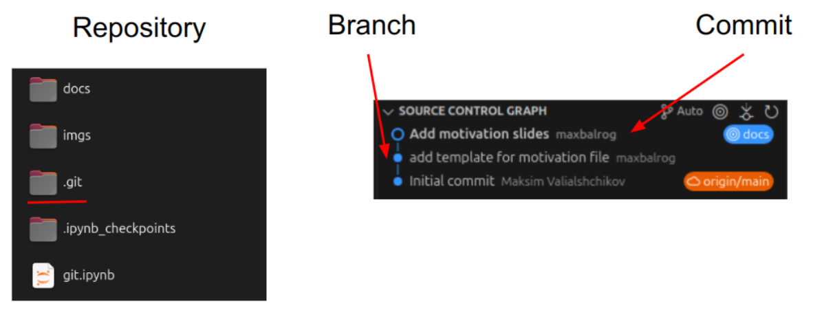
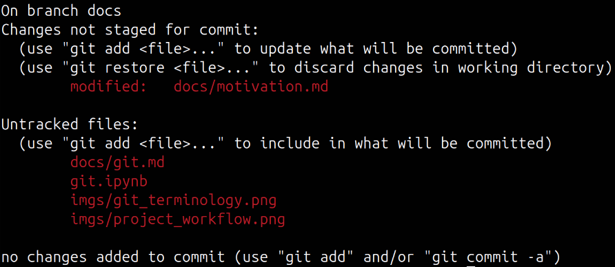

# Git and GitHub

## Glossary

**Git** - a program to track changes in test files.

**GitHub** - the social and user interface built on top of it.



**Repository** - a project's folder.

**Branch** - a parallel version of a repository.

**Commit** - an individual change to a file (or a set of files).

**.gitignore** - a file specifying which files to ignore in the repository.

Resources:

1. [Git glossary](https://docs.github.com/en/get-started/learning-about-github/github-glossary#git)

## Basic operations with repository

### Creation

Create new git repository in current directory:

```bash
git init
```

Clone repository from specified `url` to `path`:

```bash
git clone <url> (<path>)
```

For now, it is more straightforward to create an empty repository online (e.g., on GitHub) and then clone it locally.

### Branches

List all branches in a repository:

```bash
git branch
```

Create a new branch with name `branch_name`:

```bash
git branch <branch_name>
```

Delete a branch (safe version, prevents deletion if there are unmerged changes):

```bash
git branch -d <branch_name>
```

Delete a branch (hard version):

```bash
git branch -D <branch_name>
```

Switch to a particular branch (when it exists):

```bash
git switch <branch_name>
```

Create a branch and switch to it:

```bash
git switch -c <branch_name>
```

Merge `branch_name` into the current branch:

```bash
git merge <branch_name>
```

### Staging area

Check status of the repository:

```bash
git status
```



Add files or changes:

```bash
git add <file>
```

Add all files (use from the root of the project):

```bash
git add .
```

Address all additions and deletions:

```bash
git add --all
```

Remove all deleted files from version control:

```bash
git add -u
```

Restore file to its previous version:

```bash
git restore <file>
```

Remove file from tracking:

```bash
git rm --cached <file>
```

Check which files in a directory are tracked by git:

```bash
git ls-tree -r <branch_name> --name-only
```

### Commits

Commit a change:

```bash
git commit -m "this is my commit message"
```

Add the staged changes to the last commit. This can be used for fixing typos in the commit message.

```bash
git commit --amend
```

### Remote repository

Push changes to remote repo `origin`:

```bash
git push origin <branch_name>
```

Pull changes from remote repo:

```bash
git pull origin <branch_name>
```

### Git info

Check git log:

```bash
git log
```

Check remote names with url:

```bash
git remote -v
```

### Tags

List existing tags:

```bash
git tag
```

Create an annotated tag:

```bash
git tag -a <tag_name> -m "my message"
```

Show tag data:

```bash
git show <tag_name>
```

Push a tag to the remote server (all tags):

```bash
git push origin <tag_name> (--tags)
```

Resources:

1. [Adding locally hosted code to github](https://docs.github.com/en/migrations/importing-source-code/using-the-command-line-to-import-source-code/adding-locally-hosted-code-to-github).

2. [Difference between `git checkout` and `git switch`](https://stackoverflow.com/questions/57265785/whats-the-difference-between-git-switch-and-git-checkout-branch).

3. [Basics of git workflow](https://gist.github.com/blackfalcon/8428401).
